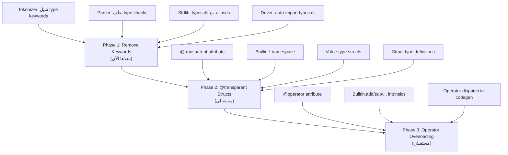

# Dolet Type System: From Hardcoded to Library-Defined

## المشكلة الحالية

الأنواع مثل `i32`, [str](file:///c:/Users/xRo0t/Desktop/xMine/dolet%20work%20spaces/dolet-compiler/bootstrap/build.py#59-63), `bool` معرّفة **hardcoded** بالـ compiler:

```
Tokenizer: "i32" → TK_I32 (keyword)
Parser:    TK_I32 → "i32" (string)
Codegen:   "i32" → LLVM i32
```

هاد يعني:
- ❌ ما يقدر المستخدم يضيف methods على الأنواع الأساسية
- ❌ كل تغيير بالأنواع محتاج تعديل بالـ compiler
- ❌ مش consistent — بعض الأنواع بالمكتبات وبعضها hardcoded

## الهدف النهائي

```dolet
# كل شيء معرّف بالمكتبات:
@transparent
struct I32:
    _raw: Builtin.int32

type i32 = I32

extend i32:
    fun abs(self) -> i32: ...
    fun max(self, other: i32) -> i32: ...

# المستخدم يكتب عادي:
x: i32 = 42
print(x.abs())  # → 42
```

---

## Phase 1: إزالة الـ Keywords (الخطوة الأولى — ننفذها الآن)

### الفكرة
شيل `i32, i64, str, ...` من قائمة الـ keywords. يصيروا identifiers عادية يتعرف عليهم من المكتبات.

### ليش آمن؟
الـ parser **أصلاً** يعالج `TK_IDENT` كأسماء أنواع:
```dolet
# parser_expr.dlt:529
if k == TK_IDENT:
    tn = cur_val()    # "i32" كـ string
    advance()
    return tn         # يرجع "i32"
```
والـ codegen يستخدم **string comparison** مش token kinds:
```dolet
# codegen_types.dlt
if str_eq(t, "i32") == 1:
    return "i32"      # MLIR type — ما يهمه من وين جاء الاسم
```

### التغييرات المطلوبة

#### [MODIFY] [tokenizer.dlt](file:///c:/Users/xRo0t/Desktop/xMine/dolet%20work%20spaces/dolet-compiler/lexer/tokenizer.dlt)

إزالة من `resolve_keyword()` (lines 457-496):
```diff
- if str_eq(name, "i8") == 1:    return TK_I8
- if str_eq(name, "i16") == 1:   return TK_I16
- if str_eq(name, "i32") == 1:   return TK_I32
- if str_eq(name, "i64") == 1:   return TK_I64
- if str_eq(name, "i128") == 1:  return TK_I128
- if str_eq(name, "ptr") == 1:   return TK_PTR
- if str_eq(name, "u8") == 1:    return TK_U8
- if str_eq(name, "u16") == 1:   return TK_U16
- if str_eq(name, "u32") == 1:   return TK_U32
- if str_eq(name, "u64") == 1:   return TK_U64
- if str_eq(name, "u128") == 1:  return TK_U128
- if str_eq(name, "f32") == 1:   return TK_F32
- if str_eq(name, "f64") == 1:   return TK_F64
- if str_eq(name, "str") == 1:   return TK_STR_TYPE
- if str_eq(name, "char") == 1:  return TK_CHAR_TYPE
```

**يبقوا keywords**: `list`, `map`, `array` (محتاجينهم لـ `[1,2,3]` literal syntax)

#### [MODIFY] [parser_core.dlt](file:///c:/Users/xRo0t/Desktop/xMine/dolet%20work%20spaces/dolet-compiler/parser/parser_core.dlt)

- `is_type_token()`: إزالة checks لـ TK_I8..TK_F64, TK_STR_TYPE, TK_CHAR_TYPE
- `token_to_type_str()`: إزالة entries لـ TK_I8..TK_F64

> [!NOTE]
> `parse_type_name()` ما محتاج تعديل — الـ `TK_IDENT` branch يعالج كل شيء.

#### [NEW] [types.dlt](file:///c:/Users/xRo0t/Desktop/xMine/dolet%20work%20spaces/dolet-compiler/library/std/std/types.dlt)

```dolet
# Standard Type Definitions
# identity aliases — الـ codegen يتعرف عليهم بالاسم

type i8 = i8
type i16 = i16
type i32 = i32
type i64 = i64
type i128 = i128
type u8 = u8
type u16 = u16
type u32 = u32
type u64 = u64
type u128 = u128
type f32 = f32
type f64 = f64
type str = str
type char = char
type bool = bool
type ptr = ptr
```

#### [MODIFY] [doletc_driver.dlt](file:///c:/Users/xRo0t/Desktop/xMine/dolet%20work%20spaces/dolet-compiler/driver/doletc_driver.dlt)

إضافة auto-import لـ [types.dlt](file:///c:/Users/xRo0t/Desktop/xMine/dolet%20work%20spaces/dolet-compiler/codegen/codegen_types.dlt) قبل باقي المكتبات:
```dolet
r_types: str = read_file_to_string(Str.concat(std_base, "types.dlt"))
if Memory.strlen(r_types) > 0:
    runtime_src = Str.concat(runtime_src, Str.concat("\n", r_types))
```

### التحقق
1. Bootstrap compile → `doletc.exe` جديد
2. [test_collections.dlt](file:///c:/Users/xRo0t/Desktop/xMine/dolet%20work%20spaces/dolet-compiler/tests/test_collections.dlt) — كل الـ 16 نوع
3. [test_unsigned.dlt](file:///c:/Users/xRo0t/Desktop/xMine/dolet%20work%20spaces/dolet-compiler/tests/test_unsigned.dlt) — list methods
4. ❌ لا push

---

## Phase 2: `@transparent` Structs (مستقبلي)

### الفكرة
بدل identity aliases، الأنواع تصير **structs حقيقية** لكن بدون overhead:

```
الحالي:       type i32 = i32      (alias بسيط)
المستقبلي:    type i32 = I32      (struct wrapper)
```

### Builtin Types (يوفرها الـ Compiler)

```dolet
# هدول أنواع خام — الـ compiler يعرفهم مباشرة
# مش متاحين للمستخدم العادي، فقط للمكتبات

Builtin.int8     # → LLVM i8
Builtin.int16    # → LLVM i16
Builtin.int32    # → LLVM i32
Builtin.int64    # → LLVM i64
Builtin.int128   # → LLVM i128
Builtin.float32  # → LLVM f32
Builtin.float64  # → LLVM f64
Builtin.ptr      # → LLVM ptr
Builtin.bool     # → LLVM i1
```

### `@transparent` Attribute

```dolet
@transparent
struct I32:
    _raw: Builtin.int32

# @transparent يعني:
# 1. الـ struct لازم يكون فيه field وحيد
# 2. بالـ MLIR: I32 = i32 (نفس النوع الداخلي)
# 3. لا malloc, لا pointer — قيمة مباشرة بالـ register
# 4. self يمرر by-value (مش by-pointer)
```

### ملفات المكتبة الجديدة

```dolet
# library/std/std/types/integers.dlt

@transparent
struct I8:
    _raw: Builtin.int8

@transparent
struct I16:
    _raw: Builtin.int16

@transparent
struct I32:
    _raw: Builtin.int32

@transparent
struct I64:
    _raw: Builtin.int64

@transparent
struct I128:
    _raw: Builtin.int128

# Unsigned variants
@transparent
struct U8:
    _raw: Builtin.int8    # same raw type, different semantics

@transparent
struct U16:
    _raw: Builtin.int16

# ... etc

# Type aliases
type i8 = I8
type i16 = I16
type i32 = I32
type i64 = I64
type i128 = I128
type u8 = U8
type u16 = U16
# ... etc
```

```dolet
# library/std/std/types/floats.dlt

@transparent
struct F32:
    _raw: Builtin.float32

@transparent
struct F64:
    _raw: Builtin.float64

type f32 = F32
type f64 = F64
```

```dolet
# library/std/std/types/string.dlt

struct Str:
    data: ptr        # pointer to UTF-8 bytes
    length: i64      # byte count

type str = Str
```

### التغييرات المطلوبة بالـ Compiler

| المكون | التغيير |
|--------|---------|
| **Parser** | يفهم `@transparent` كـ attribute على struct |
| **AST** | يخزن الـ attribute مع الـ struct node |
| **Codegen** | `@transparent` struct → يستخدم نوع الـ field الداخلي بالـ MLIR |
| **Type resolver** | `Builtin.int32` → LLVM `i32` |
| **Method codegen** | `self` بالـ `@transparent` → by-value مش by-pointer |

### كيف يشتغل بالـ MLIR

```dolet
# المصدر:
x: i32 = 42
y: i32 = x + 1
```

```mlir
; MLIR الناتج — نفس الكود الحالي بالظبط!
%0 = llvm.mlir.constant(42 : i32) : i32
%1 = llvm.mlir.constant(1 : i32) : i32
%2 = llvm.add %0, %1 : i32
; 
; لا overhead — @transparent يمحي الـ struct wrapper
```

---

## Phase 3: Operator Overloading (مستقبلي)

### الفكرة
العمليات `+`, `-`, `*`, `==` تتحول لنداءات methods:

```dolet
extend i32:
    @operator("+")
    fun add(self, other: i32) -> i32:
        return Builtin.add_i32(self._raw, other._raw)

    @operator("==")
    fun eq(self, other: i32) -> bool:
        return Builtin.eq_i32(self._raw, other._raw)

    @operator("<")
    fun lt(self, other: i32) -> bool:
        return Builtin.lt_i32(self._raw, other._raw)
```

### Builtin Operations

```dolet
# عمليات خام يوفرها الـ compiler:
Builtin.add_i32(a, b) -> i32     # → llvm.add
Builtin.sub_i32(a, b) -> i32     # → llvm.sub
Builtin.mul_i32(a, b) -> i32     # → llvm.mul
Builtin.div_i32(a, b) -> i32     # → llvm.sdiv
Builtin.eq_i32(a, b) -> bool     # → llvm.icmp "eq"
Builtin.lt_i32(a, b) -> bool     # → llvm.icmp "slt"
```

### التغييرات المطلوبة

| المكون | التغيير |
|--------|---------|
| **Parser** | يفهم `@operator("+")` attribute |
| **Codegen** | `a + b` → يفحص إذا فيه `@operator("+")`  → ينادي الـ method |
| **Builtin functions** | الـ compiler يوفر عمليات LLVM الخام |

---

## خطة التنفيذ بالترتيب



## Bootstrapping Strategy

```
┌─────────────────────────────────────────────────────────┐
│ الحالي: Bootstrap (Python) → doletc v1                   │
│   Python يعرف i32 كـ keyword                             │
│   doletc v1 يعرف i32 كـ keyword                          │
├─────────────────────────────────────────────────────────┤
│ Phase 1: Bootstrap → doletc v2                           │
│   Python يعرف i32 كـ keyword (ما نغير)                   │
│   doletc v2 يعرف i32 من المكتبة (ident)                  │
│   doletc v2 يكمبل نفسه → doletc v3 ✅ (ثابت)             │
├─────────────────────────────────────────────────────────┤
│ Phase 2: doletc v3 → doletc v4                           │
│   v3 يعرف @transparent + Builtin.*                       │
│   المكتبات تعرّف I32, Str, etc.                          │
│   v4 يكمبل نفسه → v5 ✅ (ثابت)                           │
├─────────────────────────────────────────────────────────┤
│ Phase 3: doletc v5 → doletc v6                           │
│   v5 يعرف @operator                                     │
│   المكتبات تعرّف +, -, *, == على الأنواع                 │
│   v6 يكمبل نفسه → v7 ✅ (ثابت - كل شيء بالمكتبات!)      │
└─────────────────────────────────────────────────────────┘
```

## ملخص النتيجة النهائية

| الآن | بعد Phase 3 |
|------|-------------|
| `i32` = keyword بالـ compiler | `i32` = اسم عادي من المكتبة |
| `+` = hardcoded بالـ codegen | `+` = method call على struct |
| لا methods على primitives | `42.abs()`, `3.14.floor()` |
| تغيير الأنواع = تعديل compiler | تغيير الأنواع = تعديل مكتبة فقط |
| compiler معقد | compiler بسيط + مكتبات قوية |
